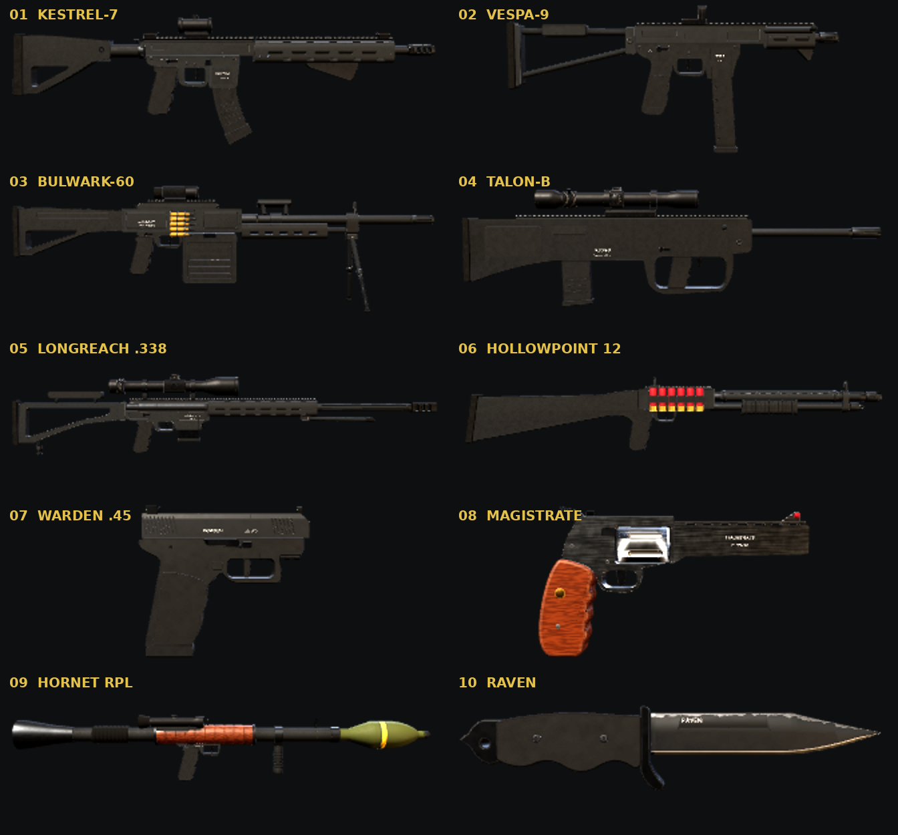

# ARMORY: 10-weapon kit, zero references

Ten original weapons in a realistic, AAA shooter style. Each one is modelled procedurally in Blender from numbers only, with no reference images, and all ten share one hard-surface toolkit.



**View it:** open `index.html` in a browser. All ten guns are embedded and meshopt-compressed, and each one is decoded when you open it. Use ↑/↓ to switch weapons, drag to orbit, and pick a camo (Graphite, Desert Tan, Ranger Green, Woodland or Gold).

| # | Weapon | Class | Highlights |
|---|--------|-------|-----------|
| 1 | KESTREL-7 | Assault rifle | Piston carbine with an M-LOK handguard, comp, micro dot and angled grip ([full gunsmith](../weapons/kestrel-7/)) |
| 2 | VESPA-9 | SMG | Left cocking tube, side-folding skeleton stock, open-emitter reflex sight, round-count holes in the mag |
| 3 | BULWARK-60 | LMG | Belt-fed from a 100-round box with linked brass visible, prism optic, carry handle, deployed bipod |
| 4 | TALON-B | Marksman | Bullpup with a full-hand trigger guard, magazine behind the grip, 1–6× LPVO in a cantilever mount |
| 5 | LONGREACH .338 | Sniper | Bolt action in a chassis, fluted barrel, triple-port brake, 5–25×56 scope with turrets |
| 6 | HOLLOWPOINT 12 | Shotgun | Pump action with a vented heat shield, crenellated breacher, ghost ring and a side saddle of six red shells |
| 7 | WARDEN .45 | Pistol | Striker-fired, front and rear serrations, tritium night sights, stippled grip |
| 8 | MAGISTRATE | Revolver | Stainless .357 with a full-lug barrel, vented rib, fluted cylinder with loaded chambers, walnut grips |
| 9 | HORNET RPL | Launcher | Walnut heat guard, flared venturi, side optic, 85 mm HE rocket loaded |
| 10 | RAVEN | Knife | Clip point with a coated flat grind and satin edge bevel, fuller, glass-breaker pommel |

## Files

| Path | What it is |
| --- | --- |
| `lib.py` | Shared toolkit: profile prisms, lathes, rods, blade loft, exact booleans, Picatinny rail, pins, cartridges, bake + export |
| `weapons/*.py` | One build script per weapon (`build()`) |
| `build.py` | `blender -b --python build.py -- <weapon> [out_dir] [--nobake]` |
| `models/*.glb` | Raw exports (per-vertex AO / convexity / concavity in COLOR_0) and `.blend` scenes |
| `models/packed/*.glb` | Meshopt-compressed copies embedded in the page |
| `pack.py` | Weapon registry (names, stats, specs) and page builder |
| `viewer_template.html` | three.js viewer: PBR, procedural camo, edge wear, grime, walnut, brushed steel |

## Rebuild

```sh
for w in vespa9 warden bulwark talonb longreach hollowpoint magistrate hornet raven; do
  blender -b --python build.py -- $w
done
npm i -g gltfpack
python3 pack.py          # -> index.html
```

KESTREL-7 is built by `../weapons/kestrel-7/build_rifle.py`. The kit reuses its GLB.
