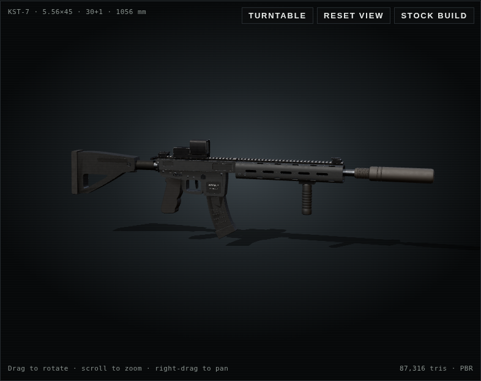
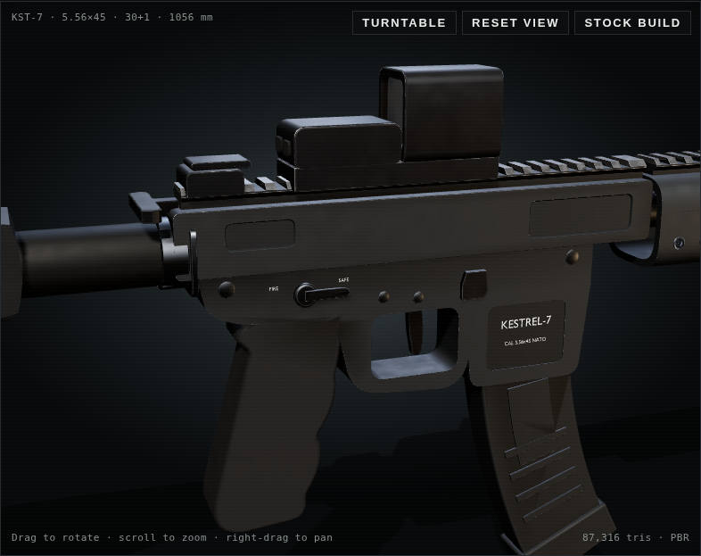
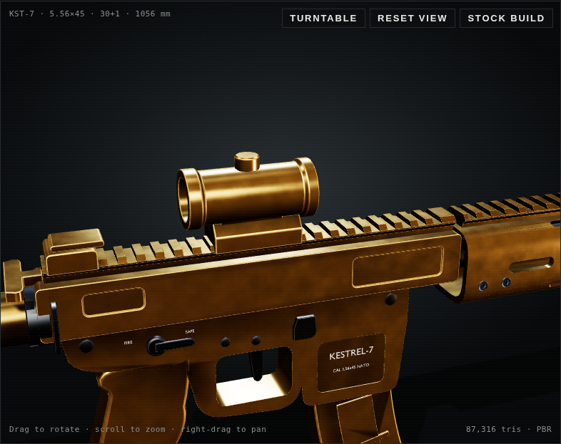

# KESTREL-7 (realistic weapon #01, zero references)

An original modern 5.56 assault rifle, built in Blender with no reference images. Every dimension was typed as numbers from how carbines are built: a MIL-STD-1913 rail at 10.01 mm pitch, 7.4 mm M-LOK slots, a 14" barrel, and a curved 30-round magazine.





**View it:** open `index.html` in a browser. The model is embedded in the page, so no server is needed. It's a gunsmith-style viewer where you can:
- swap the muzzle, optic, underbarrel grip and magazine; the camera flies to each part and the stats update
- pick a camo: Graphite, Desert Tan, Ranger Green, Woodland or Gold

| File | What it is |
| --- | --- |
| `build_rifle.py` | Builds the whole rifle and every attachment procedurally, bakes AO, exports the GLB |
| `kestrel7.glb` | Model with 11 groups (`base`, `att_*`, `buis_folded`), ~87k tris. COLOR_0 holds baked AO / convexity / concavity |
| `kestrel7.blend` | Blender 4.0 scene |
| `viewer_template.html` | Viewer source: three.js PBR, procedural camo, edge wear and grime |
| `build_viewer.py` | Embeds the GLB and writes `index.html` |

## Rebuild

```sh
blender -b --python build_rifle.py -- .   # ~30 s including the Cycles AO bake (--nobake to skip it)
python3 build_viewer.py                   # -> index.html
```

## How it gets the realistic look

- **Hard-surface modelling.** Parts are profile prisms and lathes. Ports, slots, pockets, the magwell and the hex sockets are exact boolean cuts. Angle-limited 0.4–2.5 mm bevels with hardened normals give machined edge highlights.
- **Baked data.** Cycles bakes ambient occlusion into the vertices. Per-vertex convexity drives edge wear and concavity drives grime.
- **Shading.** Physically based materials under an HDR studio environment, with ACES tone mapping and soft shadows. Cerakote chips back to bare aluminium on edges. The grip is stippled, the polymer has grain, the steel is phosphate, the lenses have an iridescent coating and the reticles glow.
