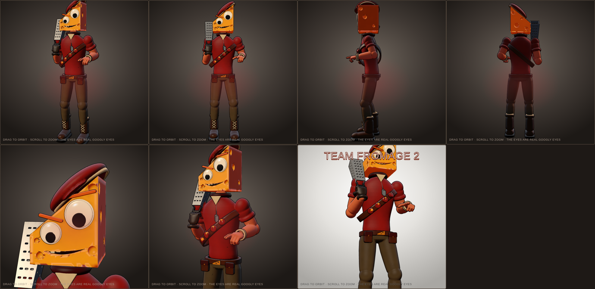

# Tim Cheese v3 (TF2-style character)

An original Team Fortress 2-style character: a lean mercenary built somewhere between the Scout and the
Demoman, with a Swiss-cheese wedge for a head, two googly eyes, a cocky smirk cut into the cheese, a newsboy
cap perched on the slope of the wedge, and real articulated hands (palm, four three-segment fingers and a
thumb per hand). Pose: the Grate Equalizer slung over his right shoulder, left index finger pointing at you.
Loadout: The Grate Equalizer (box grater), The Brie-dolier (wax-dipped cheese wheels), Fists of Gouda.

**View it:** open `index.html` in a browser. Drag to orbit, switch RED/BLU, jump, shake his head. The googly
pupils are simulated: they feel gravity and the head's motion and rattle around their housings.

| File | What it is |
| --- | --- |
| `build_cheeseman.py` | Builds the whole character procedurally (`blender -b --python build_cheeseman.py -- . [--nobake]`) |
| `build_viewer.py` | Packs the GLB (meshopt) and embeds it with `rig.json` into `index.html` |
| `viewer_template.html` | three.js viewer with the TF2-style half-Lambert toon shader, ink lines and googly physics |
| `cheeseman.packed.glb`, `rig.json` | The model the page uses, and the eye rig (pupil centres, radii) |
| `preview_*.png` | Renders straight out of the viewer |

Built on the shared toolkit in `cod/armory/lib.py`. The organic masses (shirt, each arm, each hand, pants,
each boot, the cap) are overlapping lofts, ellipsoids and capsules **fused into one continuous surface** with a
voxel remesh and smoothing, so torso flows into shoulders and fingers into palms with no seams, the way TF2
bodies are sculpted. Hard-surface parts (head, grater, belt, buckles, laces, tags) use exact booleans. A Cycles
ambient-occlusion bake goes into vertex colours. The viewer uses a TF2-style lightwarp: half-Lambert squared,
a warm band at the terminator, bright ambient, sky rim light and thin ink outlines.

History: v1 was a Heavy-sized metaball blob with no hands; v2 had fingers but stacked its parts like an action
figure under dim light; v3 fuses the masses and relights him.
