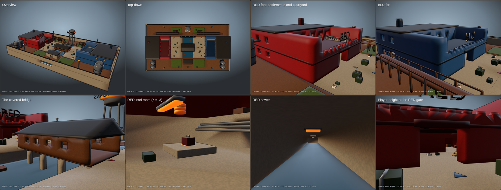

# ctf_curdworks (TF2-style Capture the Flag map)

A symmetric two-base CTF map set in the Curdworks cheese factory. Team Fortress 2 illustrative rendering
(saturated team buildings, dark stripes, cheese silos, a water tower, plank catwalks, oversized signs, a
cartoon intel briefcase) mixed with a Call of Duty edge (sandbag nests, olive military crates, a stranded troop
truck by each base, barbed wire on the perimeter, floodlight towers). Built to an Xbox One budget: about 70k
triangles (71k), one draw call per material, ambient occlusion baked into vertices so no shadow maps are needed.

**View it:** open `index.html` in a browser. Views: overview, top-down, each base, the bridge, the RED intel
room, and player height in the RED courtyard. Drag to orbit, scroll to zoom, right-drag to pan.

## Layout (108 × 60 m, three levels)

- **Forts** at each end, cut out of one solid block: gate → open courtyard → crenellated battlement walkway
  on the front wall (ramp up the south side, railed ledge on the north) → upper floor with sniper windows over
  the courtyard → stairs down → a ramp spiralling below grade into the **intel room at z = −3** (pedestal,
  glowing briefcase, ladder, pipes, lamps). **Spawn** is on the upper floor: lockers and two resupply cabinets.
- **Covered bridge** at mid: plank floor on concrete piers over the canal, walls with firing slits, a pitched
  roof on beams. Both mouths sit under the enemy battlements.
- **Sewer**: a ramp beside each fort drops to canal level; a grate leads into a lit tunnel that runs under the
  field straight into the intel room. Slow, wet, safe from snipers.
- **North catwalk**: a raised plank walkway from the fort's back door toward mid. **South**: a shed with a
  firing slit. The conveyor yard and water tower sit north of the bridge.
- **Cover**: sandbag nests in each courtyard, banded crates outside each gate, barrels, canal crates. Four
  health kits and four ammo boxes per side, including one pair down in the intel room.

## Files

| File | What it is |
| --- | --- |
| `build_map.py` | Builds the whole map procedurally; the RED half is mirrored for BLU with team materials swapped |
| `build_viewer.py`, `viewer_template.html` | Pack the model and embed it in the page with the TF2 toon shader |
| `curdworks.packed.glb` | The model the page uses |

Rebuild: `blender -b --python build_map.py -- .` then `python3 build_viewer.py`.
