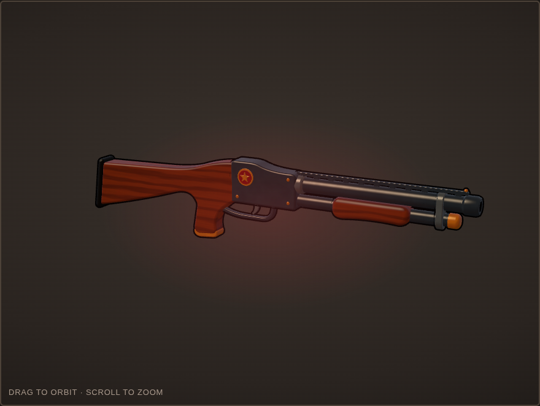
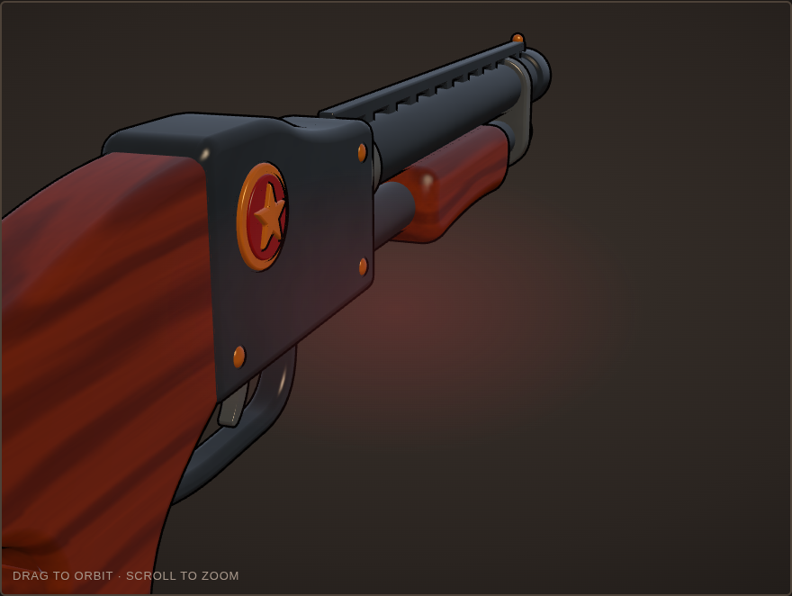

# The Lone Star Repeater (TF2-style weapon concept #01)

A semi-auto shotgun for the Engineer, modelled in the Team Fortress 2 style. The reference clip was a showcase of a community semi-auto shotgun.




**View it:** open `index.html` in a browser. The model is embedded in the page, so no server is needed. You can orbit, switch RED/BLU, change the camera view, toggle the ink lines, and switch to a clay view.

| File | What it is |
| --- | --- |
| `build_gun.py` | Blender script that builds the whole gun procedurally (28 parts, ~19.5k tris) |
| `lone_star_repeater.glb` | Exported model (Y-up, materials named Wood / Gunmetal / Steel / Brass / Rubber / Bore / Team) |
| `lone_star_repeater.blend` | Blender 4.0 scene, with the bevel modifiers still live |
| `viewer_template.html` | Viewer source: TF2-style half-Lambert toon shader and inverted-hull ink lines |
| `build_viewer.py` | Embeds the GLB into the template and writes `index.html` |

## Rebuild

```sh
blender -b --python build_gun.py -- .   # -> .glb + .blend
python3 build_viewer.py                 # -> index.html
```

## Style rules used

- **One shape language.** Every part is either a side profile that is extruded and bevelled, or a lathe turned around the bore. No kitbashed shapes.
- **Smooth everywhere.** Angle-limited bevels (4–6 segments) with hardened normals give soft TF2 edges and keep the flat faces clean.
- **Pushed proportions.** The barrel is thick, the trigger guard is big, the forend is fat and the brass caps are oversized.
- **TF2 shading.** Half-Lambert through a warm ramp, sky rim light from above, and per-material Phong specular. Wood grain and metal mottling are procedural.
- **Ink lines.** An inverted hull pushed out along smoothed normals, at a constant pixel width.

Fan concept, not affiliated with Valve.
